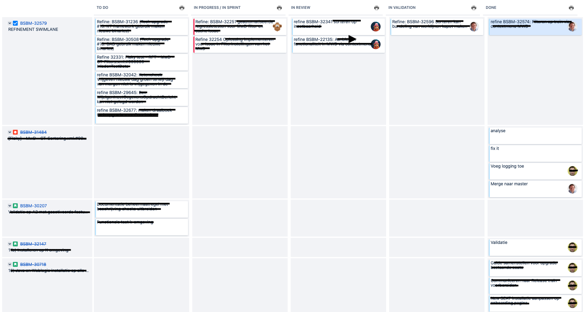
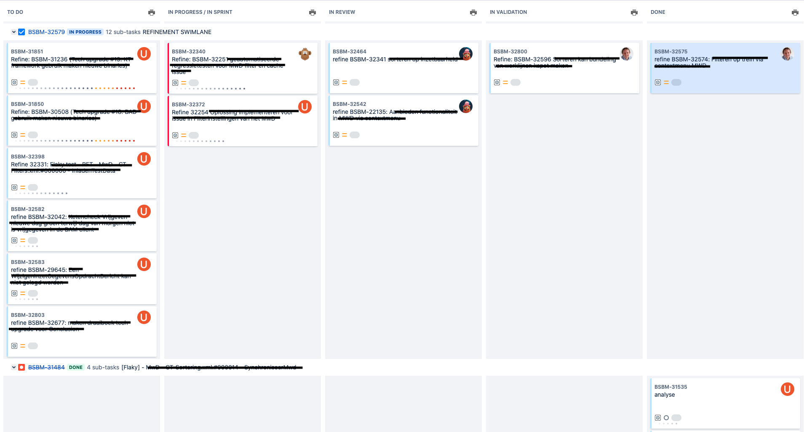

# JIRA
This folder contains styling for JIRA's active Sprint board. It takes all the distracting clutter away and attempts to show the sprint board as if it were a physical board:

[active-sprint.css]

This shows a sprint board like this:

The original would look like this:

Notice the fact that there is more than twice the information on the screen. Combine this with a good filter and you get a little bit of an overview on your sprint board again.

Please note this is supplied with the Unlicense license. Atlassian, please rework the sprint board! Use this styling if you need.
